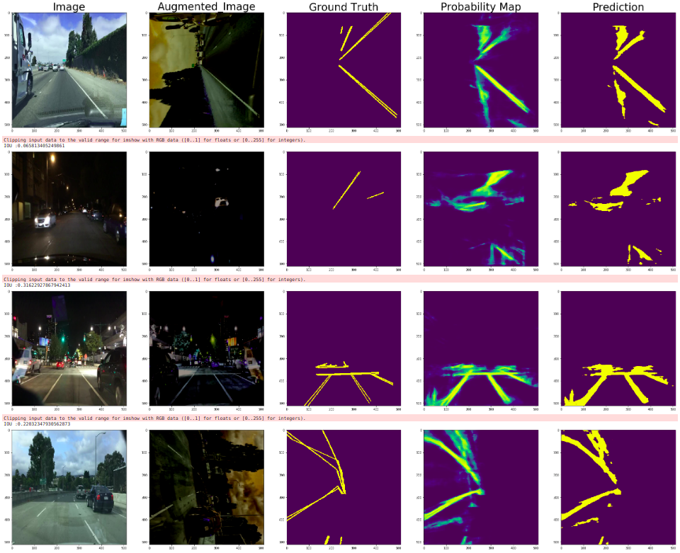
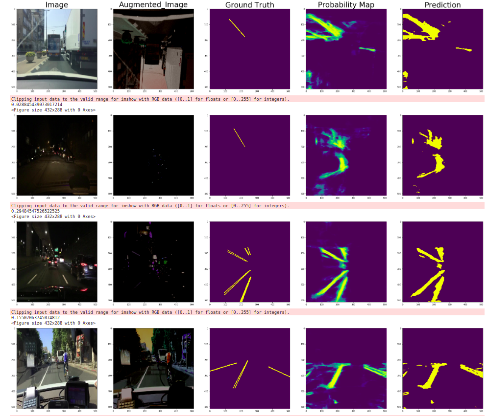
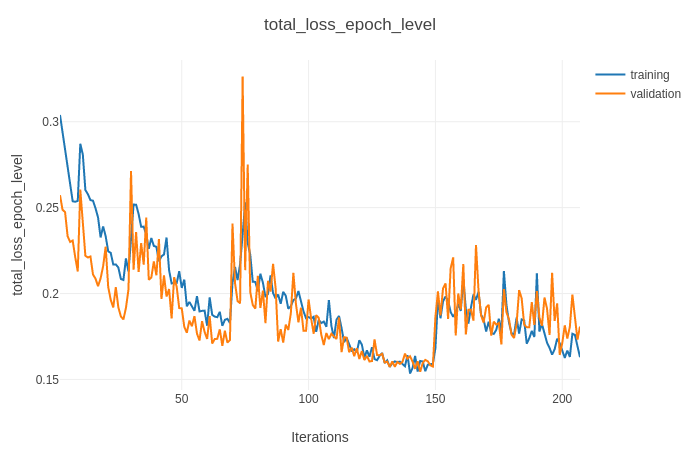
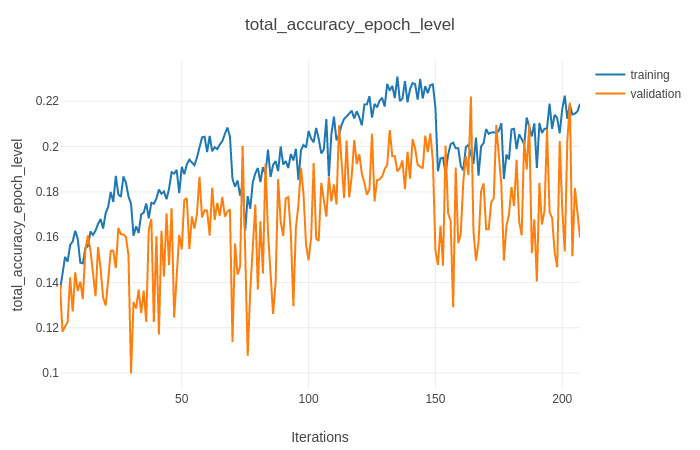

# Road Lane Detection


## About

This repository contains pytorch implementation of four semantic segmentation algorithms on a subset of BDD100K dataset
- [DeeplabV3: Rethinking Atrous Convolution for Semantic Image Segmentation](https://arxiv.org/abs/1706.05587) 
- [ENet: A Deep Neural Network Architecture for Real-Time Semantic Segmentation](https://arxiv.org/pdf/1606.02147.pdf) 
- [ERFNet: Efficient Residual Factorized ConvNet for
Real-time Semantic Segmentation](http://www.robesafe.es/personal/eduardo.romera/pdfs/Romera17tits.pdf)
- [SCNN: Spatial As Deep: Spatial CNN for Traffic Scene Understanding](https://arxiv.org/abs/1712.06080)

## Files

- [`train.py`](train.py) : Python code for training the algorithm with different configurations that can be specified in the config files
- [`trainer.py`](trainer.py) : A helper function that is called by the above file
- [`exp_result_summary.csv`](exp_result_summary.csv) : A summary of 8 experiments that have been carried by a combination of network achitectures, loss functions and their weighing scheme
- [`pretrained_backbone`](pretrained_backbone) : Contains different models that had been trained on similar datasets - TuSimple and CuLane. A transfer learning approach has been applied here
- [`seger`](seger) : folder containing the backbone of the semantic segmentation pipeline
- [`Notebooks`](Notebooks) : Contains inference and experiment analysis modules as jupyter notebooks. Accepts the experiment config file (json file inside cfgs folder) as inputs and generate visualisation of outputs and calcualates experiment losses and accuracies
- [`cfgs`](cfgs) : Contains config files for experiments (need to input different parameters for training)
- [`data`](data) : Pytorch dataloader has been written in such a way that it accepts train and val files containing (image_name,image_mask) in separate lines


## Usage


For training the models, run the below command

```
$ python train.py -cfg="baseline-x.json"
```
where x = experiment number

Maintain a ``x_train.txt`` and ```x_val.txt``` inside ```data``` folder.
The train and trainer uses a config files that can be configured to accept inputs

- `num_classes` : The repository is for multiclass semantic segmentation (minimum 2 classes). **Note: The present BDD lane marking problem is treated as multiclass segmentation problem. Loss function should be weighed properly to handle class imbalance**
- `arch_name` : enet, erfnet, scnn and deeplabv3. Check ```seger/models/networks.py```
- `loss` : ce_loss(cross-entropy loss), dice(generalised dice loss to handle class imbalance) and weighed_ce_loss(weighted CE loss : need to specify weights) . Check ```seger/loss.py```
- `sched_name` : different schedulers. Mainly SGDR (warm restarts with cossine annealing) has been used. Check ```seger/optims/get_scheduler.py```
- `optim` : adam and sgd used here. Check ```seger/optims/get_optimizer.py```


## About the problem !


**1. Brief overview of the problem at hand** 

**2. Architectures that have been used and experimented** 

**3. Some training strategies that have used here**

## Introduction

**Lane detection** plays a pivotal role in autonomous
driving as lanes could serve as significant cues for constraining the maneuver of vehicles on roads. Detectinglanes in-the-wild is challenging due to poor lighting conditions, occlusions caused by other vehicles, irrelevant road markings, and the inherent long and thin property of lanes.

Here, the problem of lane marking detection is treated a [semantic segmentation](https://people.eecs.berkeley.edu/~jonlong/long_shelhamer_fcn.pdf) problem. In other words lane detection is treated as a task where each pixel in an image is
assigned with a binary label to indicate whether it belongs to a lane or not.

## Algorithms Implemented

1. Deeplabv4
2. ENet 
3. ERFNet
4. SCNN 

## Training Strategies 


- **Augmentation Strategies** : BDD Dataset contains many challenging driving scenar-
ios like crowded road conditions or roads under poor lighting. Also, the size of the subset of dataset is small. The code used albumnetation (by fastai) to generate batches of random horizontal flip, verical flip, transpose, randomscalecrop, perpective transform, contrast and brightness adjustment, guassian blurring transformations applied with certain probability on the fly

- **Scheduler** : [SGD with Warm Restarts](https://arxiv.org/abs/1608.03983) with cossine annealing has been mainly used because we can start out with relatively high learning rates for several iterations in the beginning to quickly approach a local minimum. Then, we can reset our learning rate every so many iterations so that we may be able to more easily pop out of a local minimum if stuck there. The max lr and min lr under which it has been varied has been chosen by a trial-and-error method i.e. experimenting on different lr ranges and intuitively choose lr as mentioned in benchmark papers on the same dataset

- **Loss Function** :  Mainly two loss functions have been explored here as explained below. Also, it was observed that there is a high class imbalance (since here I treated the problems as multiclass segmentation problems with num_class=2) between foreground and background pixels. A rough estimate of a batch of segmentation maps yielded a ratio of 400:1 between the two classes. This explains that **those loss functions should be preferrred that handles class imbalance well** (focal loss, dice loss etc.). A 1:25, 1:200 and 1:1000 weighing scheme was tested on the loss functions. Loss functions used here are [cross entropy loss](https://pytorch.org/docs/stable/nn.html#crossentropyloss) and [generalised dice loss](https://arxiv.org/abs/1707.03237)


- **Transfer Learning** : Many of the models reported below are based on weight and parameter initialisation based on a pretrained model available on different datasets (CityScape, TuSimple and CULane). Each of the pretrained models were trained to output more than 2 classes (for CityScape 37, CULane 5 and TuSimple 2). The model was loaded in state dict and the last layer was re-configured to generate output of n_channels (here num_classes=2)

### Experiment Summary

| exp_name  | arch_name | pretrained_on | loss_name       | loss_weights | lr_scheduler_name | optimizer_name | train_iou | train_loss | val_iou | val_loss | 
|-----------|-----------|---------------|-----------------|--------------|-------------------|----------------|-----------|------------|---------|----------| 
| exp1_lane | deeplabv3 | Imagenet      | weighed_ce_loss | 1:200        | sgdr              | adam           | 0.04196   | 0.28467    | 0.03435 | 0.34493  | 
| exp2_lane | enet      | TuSimple      | weighed_ce_loss | 1:200        | sgdr              | sgd            | 0.03269   | 0.48446    | 0.03774 | 0.30949  | 
| exp3_lane | scnn      | CULane        | weighed_ce_loss | 1:100        | sgdr              | sgd            | 0.16097   | 0.20345    | 0.07659 | 0.19820  | 
| exp4_lane | scnn      | CULane        | dice            | 1:500        | sgdr              | sgd            | 0.00678   | 0.99980    | 0.02524 | 0.99996  | 
| exp5_lane | deeplabv3 | Imagenet      | weighed_ce_loss | 1:200        | StepLR            | adam           | 0.04247   | 0.35033    | 0.03433 | 0.30765  | 
| exp6_lane | erfnet    | CityScape     | weighed_ce_loss | 1:100        | sgdr              | sgd            | 0.16367   | 0.11841    | 0.08270 | 0.19564  | 
| **exp7_lane** | erfnet    | CityScape     | weighed_ce_loss | 1:25         | sgdr              | sgd            | 0.22743   | 0.09301    | **0.19364** | 0.22018  | 
| **exp8_lane** | scnn      | CULane        | weighed_ce_loss | 1:25         | sgdr              | sgd            | 0.21985   | 0.14080    | **0.18764** | 0.22438  | 


**Metric Chosen** : Mean IOU has been reported in the above table as a metric for a comparison between different models. As shown above, the model achieves an mean-IOU of 0.19 with class balancing in ratio (1:25) with ERFnet and SCNN which is comparable to [SOTA on BDD](https://paperswithcode.com/sota/lane-detection-on-bdd100k)

## Final Architectures chosen

#### ***ERFNet:***

ConvNet for realtime and accurate semantic segmentation.

-  The core element of architecture is a novel layer design that leverages skip connections and convolutions with 1D kernels. Proposes re-design of the residual layers to make them more efficient

- Recent semantic segmentation Residual Networks achieve good accuracy at the cost of resources. On the other hand, Enet is lower on accuracy but faster during inference stage.

- Built on top of E-Net, follows a similar strategy to ENet in having a small decoder. Rather than upsampling by max-unpooling, it used simple deconvolutional layers with stride 2. Saves on memory by not storing the poooling index from encoder


### Results

#### **Model Predictions Vs Ground truth**

##### ***Training Set Result Visualisation***

<p align="center">
    
</p>


##### ***Validation Set Result Visualisation***

<p align="center">
    
</p>


#### **Accuracy and Loss plots for training and validation**

<p align="center">
    
</p>

<p align="center">
    
</p>


#### **Comments**

- The dataset has high number of occlusions (a practical problem) and a number of images taken under bad illumination. Sometimes, the lane is not even properly distinguishable to human eye. The algorithm finds it difficult to generate output in those condition


- While the network is successful in multi-context learning (evident by accurate localisation of lane in the region), the the segmentation outputs need to be refined to give more pizel level accuracy

- Implement an algorithm to get more coarser and finer segmentation outputs around the edges of the foreground mask in the segmentation output
